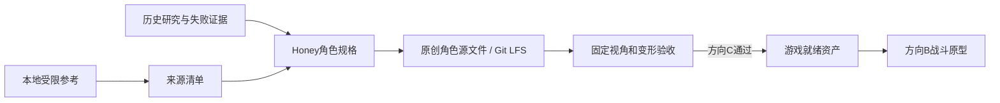

# 方向 C 项目重整与方向 B 准入计划

## 用户需求

重新整理现有项目的文档、计划、资产内容、工具和开发环境，使项目从“历史研究归档”转变为可持续推进的正式制作仓库。

新增约束：以当前 Mac M4 作为正式生产主机；Windows 仅承担 Model 2 等 Windows-only 资产提取，以及方向 B 后的 Windows 构建、输入和性能验证。项目管理继续使用 Git，美术资产采用 Git、Git LFS、本地受限存储和备份分层管理。

## 产品概述

项目先执行方向 C，以 Honey 正常状态为首个高清角色，采用人工可控的角色生产流程；当角色达到游戏就绪标准后，再通过明确门槛进入方向 B，开发 1v1 战斗原型。破甲造型、完整阵容和大规模玩法暂不进入当前阶段。

## 核心功能

- 区分当前状态、正式方案、历史实验和失败路线，避免过期结论被误当作当前进度。
- 建立方向 C 的分阶段路线：参考资料冻结、角色规格、模型、材质、绑定、引擎验收和视觉检查。
- 设置方向 C 到方向 B 的准入门槛；门槛通过前只允许占位角色和导入验证，不扩大战斗开发。
- 分离原始参考、工作源文件、自动生成内容、评审产物、游戏就绪资产和历史归档。
- 为每项外部参考和角色资产记录来源、用途、授权边界、校验值及对应版本。
- 固定 Mac-first 跨平台开发环境和职责边界，保证新环境能够按文档复现。
- 按可用、实验、已拒绝状态整理工具，保留失败证据但不污染正式工作流。
- 用少量可验收里程碑管理进度，每个阶段具有明确的通过、返工或终止条件。
- 对不可合并的二进制美术源文件执行所有权、LFS 锁定、里程碑快照和导出追踪。

## 技术栈选择

- **正式文档**：Markdown；状态清单和来源清单使用 CSV；本地工具链配置使用 TOML。
- **主开发环境**：Apple Silicon Mac M4，承担方向 C 的正式角色生产、Unity 日常验证和未来方向 B 的主要开发。
- **角色制作**：Blender 4.5 LTS，承担建模、重拓扑、UV、骨骼、权重和可控导出。
- **游戏验证**：沿用 Unity 6 路线，初始固定历史已验证的 `6000.4.1f1` Apple Silicon Editor；新工程使用 URP，以兼顾 macOS 制作、Windows 验证和后续双角色性能。
- **自动检查**：Python 3 标准库实现跨平台环境检查；Blender 自动化优先使用其内置 Python。
- **Windows 辅助环境**：保留现有 PowerShell、Model 2 Emulator、Noesis/Ninja Ripper 等提取链路；方向 B 后负责 Windows Player、DirectX、手柄和目标硬件性能验证。
- **媒体处理**：继续使用 FFmpeg，但在工具链清单中固定最低版本和探测方式。
- **版本控制**：文本、小型原创资产、Unity 源码与配置使用普通 Git；原创大型 DCC 源文件和批准的二进制导出使用 Git LFS；ROM、模拟器 dump、第三方包、AI 批量生成物、缓存和受限参考素材保持本地专用。
- **AI 3D 环境**：CUDA/Hunyuan3D 不作为 C0 必需环境；需要时使用独立 NVIDIA 机器或云服务，结果仍按生成中间物管理。

## 开发环境职责

### Mac M4：正式生产主环境

- Blender 建模、拓扑、UV、材质、骨骼与权重。
- Unity URP 角色导入、固定验证场景、视觉 QA 和未来战斗逻辑开发。
- Python、FFmpeg、Git、Git LFS 和文档维护。
- 使用 Apple Silicon 原生工具，不把 Rosetta 或 Windows-only 插件作为正式管线依赖。

### Windows：按需辅助环境

- Model 2 Emulator、texture cache dump、Ninja Ripper、Noesis 和现有 PowerShell 提取工具。
- 方向 C 中只在出现明确参考缺口时进行定向采集，不作为日常建模前置条件。
- 方向 B 开始后执行 Windows Player 构建、DirectX、手柄、文件路径和目标 GPU 性能验证。
- Windows 提取结果先进入本地受限区，只有来源清晰、允许进入生产的派生信息或原创结果才能进入正式仓库。

### 平台原则

- 方向 C 可以仅使用 Mac M4 启动和完成；Windows 不是日常开发硬依赖。
- Mac 上不能运行的 CUDA 旧实验不得阻塞 C0～C6。
- 若 Unity `6000.4.1f1` Apple Silicon 版本无法稳定复现，必须通过新的决策记录批准替代版本，不能由个人静默升级。
- 方向 B 的每个发布候选必须经过 Windows 实机验证，Mac 编辑器验证不能替代目标平台验证。

## 美术资产管理策略

美术资产不采用“所有文件都直接塞进普通 Git”的方式，而是四层管理。

### 1. 普通 Git：可合并、轻量、必须审计

纳入普通 Git：

- 角色规格、QA、来源和资产 manifest。
- Blender/Unity 导出脚本、材质配置和工具配置。
- Unity scenes、prefabs、controller、代码、`Packages`、`ProjectSettings` 和所有必要 `.meta` 文件。
- 小型、原创且适合普通 Git 的文本或配置资产。

### 2. Git LFS：正式二进制源资产与批准导出

纳入 Git LFS：

- 原创 `.blend`、`.fbx`、高分辨率原创 `.png/.tif/.exr`，以及确有必要的其他 DCC 二进制源文件。
- 进入里程碑评审的 Review 输出和进入 `Game/` 的批准版角色导出。
- 只保存“当前可编辑主文件 + 关键里程碑快照”，不提交每次自动保存、缓存和批量试验结果。

协作规则：

- `.blend`、Substance 工程等不可合并文件启用 Git LFS locking；修改前锁定，合并后解锁。
- 每个角色资产在同一阶段只有一个明确负责人，避免二进制文件并行分叉。
- 工作源文件允许显式版本号，如 `Honey_Retopology_v003.blend`；进入 Unity 的稳定文件使用固定名称，如 `Honey.fbx`，由 Git/LFS 历史记录版本，避免破坏资源引用。
- Git LFS 远端容量和费用必须在首次提交大型资产前确认；未确认远端时只建立规则，不上传大型文件。

### 3. LocalData：不可发布、可再生或高噪声内容

保持在被忽略的 `LocalData/`：

- ROM、模拟器、dump、Ninja Ripper 抓取、第三方下载包。
- 原作截图、视频、来源授权不清的参考素材。
- AI 批量输出、Hunyuan/Meshy 中间物、临时 bake、缓存、自动保存和失败实验大文件。
- 个人绝对路径和本地工具配置。

这些文件由 manifest 中的逻辑路径和 SHA-256 标识，但不进入 Git 或 Git LFS。

### 4. 备份与发布快照

- Git LFS 不是完整备份；`ArtSource/` 的正式主文件必须另有至少一份独立备份。
- 每个 C2～C6 里程碑建立资产清单，记录源文件、导出文件、哈希、负责人、评审结论和对应 Git commit/tag。
- C6 产物形成可重建发布快照；不把个人缓存或受限参考打入发布包。
- 共享对象存储/NAS/云盘的具体服务后续选择，但其职责仅为备份和本地受限素材同步，不能替代 Git 中的来源和版本记录。

## 实施方法

采用“正式生产区、历史证据区、本地受限区、未来游戏工程区”四层结构：

1. `Docs/` 保存当前方案、路线图、决策和验收规则。
2. `Reference/ResearchNotes/` 保持历史实验性质，不重写失败结果。
3. `ArtSource/` 保存经授权的原创角色源文件；`LocalData/` 保存不进入仓库的原始资料、抓取文件和生成中间物。
4. 后续在 `Game/` 初始化独立 Unity 工程，避免与研究工具、角色源文件及受限素材混放。

本轮只完成仓库和环境基线，不制作 Honey 模型，也不启动战斗功能。完成后按独立的方向 C 生产计划推进；方向 B 由准入检查结果触发。

## 方向 C 里程碑

- **C0 基线就绪**：目录、来源规则、工具清单、Mac-first 环境检查、美术资产管理规则和验收模板可用。
- **C1 参考冻结**：Honey 正常状态参考清单和角色规格完成，关键视角、比例、色彩和部件关系无重大歧义。
- **C2 Blockout**：正侧背轮廓和游戏镜头比例通过评审，未通过时不得进入细节雕刻。
- **C3 拓扑和 UV**：身体、脸部和主要关节适合变形；裙摆、双马尾、袖口具有明确的独立控制方案。
- **C4 材质**：色块、图案和材质层次符合角色规格，自动生成纹理只能作为可编辑底稿。
- **C5 绑定和变形**：基础站立、行走、受击和踢击姿势无严重塌陷、拉伸或穿模。
- **C6 游戏就绪验收**：可重复导出并稳定导入固定验证场景，来源、性能、版本和视觉检查全部通过。

## 方向 C 到方向 B 的 Gate

只有同时满足以下条件才启动正式战斗开发：

- Honey 正常状态拥有可维护的源模型、稳定拓扑、UV、材质、骨架和权重。
- 固定动作测试不存在阻塞级变形问题。
- 固定正侧背和游戏镜头评审通过。
- 从干净工作区可以按文档重复完成导出和导入。
- 游戏就绪资产不依赖来源不清或不可发布的外部素材。
- 美术主文件、批准导出、manifest、哈希和里程碑 Git/LFS 版本能够闭环对应。
- 单角色验证场景具有足够性能余量，能够扩展到双角色和竞技场。
- 所有阻塞项关闭；非阻塞问题已进入明确的后续列表。
- Windows 目标平台验证方案已经准备，但在 C6 前不要求完成完整战斗构建。

## 架构设计



## 目录结构

```text
NewFighingVipers/
├── README.md
│   # [MODIFY] 改为项目入口，只展示当前阶段、快速导航、C阶段状态和B阶段准入状态。
├── .gitignore
│   # [MODIFY] 不再笼统忽略未来游戏源码；精确排除缓存、LocalData内容、ROM、dump和生成中间物。
├── .gitattributes
│   # [NEW] 为原创大型模型和纹理配置Git LFS与锁定；不得把受限外部素材纳入LFS。
├── Docs/
│   ├── PROJECT_STATUS.md
│   │   # [NEW] 当前事实、已有成果、缺口、风险和下一决策；替代从历史笔记推断现状。
│   ├── ROADMAP.md
│   │   # [NEW] 定义C0至C6里程碑、交付物、负责人、通过条件及C到B准入门槛。
│   ├── DECISIONS.md
│   │   # [NEW] 记录Mac-first、仓库布局、游戏工程位置、URP和版本选择，注明替代的历史假设。
│   ├── Development/
│   │   ├── SETUP.md
│   │   │   # [NEW] Mac M4主环境、Windows辅助环境、版本固定、本地配置、健康检查和复现步骤。
│   │   ├── ASSET_PIPELINE.md
│   │   │   # [NEW] 参考资料到角色源文件、评审输出和游戏资产的单向生产流程及命名规则。
│   │   ├── ART_ASSET_MANAGEMENT.md
│   │   │   # [NEW] Git/LFS/LocalData/备份分层、二进制锁定、所有权、版本、快照与恢复规则。
│   │   └── VERSION_CONTROL.md
│   │       # [NEW] 普通Git、LFS、本地专用内容、分支、标签和发布边界。
│   └── Production/Honey/
│       ├── CHARACTER_BIBLE.md
│       │   # [NEW] 正常状态比例、轮廓、部件、颜色、材质和允许补充设计的边界。
│       ├── ASSET_SPEC.md
│       │   # [NEW] 拓扑、UV、材质、骨架、权重、命名、导出和性能预算的可测规格。
│       └── QA_CHECKLIST.md
│           # [NEW] 固定视角、模型完整性、变形、材质、来源和游戏导入验收表。
├── Reference/
│   ├── ResearchNotes/
│   │   └── _guide.md
│   │       # [MODIFY] 明确历史笔记不可替代正式文档，并补充Docs和来源清单链接。
│   └── Manifests/
│       ├── honey-reference-manifest.csv
│       │   # [NEW] 来源编号、URL、本地逻辑路径、哈希、权利状态、用途和审核结论。
│       └── honey-asset-manifest.csv
│           # [NEW] 源文件、导出、阶段、哈希、负责人、评审、Git/LFS版本和发布状态。
├── ArtSource/
│   └── Characters/Honey/README.md
│       # [NEW] 规定Blockout、Sculpt、Retopo、Texture、Rig、Export和Review目录及文件命名。
├── LocalData/
│   └── README.md
│       # [NEW] 描述Raw、Captures、Generated、ThirdParty、Autosave和Cache本地目录；实际内容全部忽略。
├── Game/
│   └── README.md
│       # [NEW] 预留独立Unity工程，说明C6前仅允许角色导入和固定验证场景。
├── Tools/
│   ├── README.md
│   │   # [NEW] 工具总入口，按stable、experimental、rejected、reference分类并链接使用说明。
│   ├── tool-manifest.csv
│   │   # [NEW] 逐项记录现有脚本的平台、状态、输入、输出、依赖、风险和对应研究证据。
│   ├── Environment/
│   │   ├── check_environment.py
│   │   │   # [NEW] 只读检查Mac主环境及可选Windows能力，不下载、不修改配置、不输出敏感路径。
│   │   └── toolchain.example.toml
│   │       # [NEW] 声明期望版本、平台角色和逻辑路径；个人绝对路径写入被忽略的本地副本。
│   ├── Extraction/Model2/README.md
│   │   # [NEW] 汇总现有提取脚本的可靠入口、Windows限制、输入输出和副作用验证要求。
│   ├── Generation/Hunyuan3D/README.md
│   │   # [NEW] 标明包装脚本可复盘，但当前Honey多视图路线已拒绝，不属于正式C主线或Mac必需环境。
│   └── Windows/PowerShell-Runbook.md
│       # [MODIFY] 补充工具清单、LocalData路径约定和跨平台职责链接，不改已有安全规则。
```

现有研究笔记和脚本首轮不移动、不改名，避免破坏引用和历史证据。分类先通过 manifest 与 README 完成；确需移动时再建立单独迁移计划。

## 关键数据约定

- `honey-reference-manifest.csv` 至少包含：来源编号、角色状态、视角、来源链接、本地逻辑路径、SHA-256、权利状态、允许用途、采用结论、关联笔记。
- `honey-asset-manifest.csv` 至少包含：资产编号、阶段、源逻辑路径、批准导出路径、SHA-256、负责人、LFS 状态、锁定状态、评审结论、对应 commit/tag、发布状态。
- `tool-manifest.csv` 至少包含：工具路径、平台、状态、依赖、输入、输出、副作用、验证方式、替代方案、证据笔记。
- 原创工作文件采用版本号命名；进入游戏工程后的稳定资产不在文件名中滚动版本，避免引用和资源标识失效。

## 实施注意事项

- 健康检查只读取环境和清单，复杂度为清单数量的线性级别；默认不递归扫描大型本地素材目录。
- 通过文件哈希识别参考资料、源资产和导出版本，避免重复复制和来源漂移。
- 不删除失败实验，不把 Hunyuan3D 或消息注入路线重新包装成默认生产工具。
- 日志只记录逻辑路径、版本和可操作错误，不输出个人目录、密钥或完整受限素材名称。
- 首轮不批量改写历史笔记和脚本，先建立新入口与兼容边界，控制整理工作的影响范围。
- URP 和 Mac-first 决策写入正式决策记录；Unity 版本变化必须由新决策记录批准。
- 首次上传大型美术资产前验证 Git LFS 远端、容量、锁定支持和恢复流程。
- Git LFS 不是备份；正式主文件必须有独立备份和里程碑恢复演练。

## Agent Extensions

- **code-explorer**
- Purpose：盘点现有文档、工具、引用关系和历史状态，避免遗漏或错误迁移。
- Expected outcome：生成可核对的仓库基线，并验证新索引、工具清单、环境职责和文档链接覆盖全部现有内容。